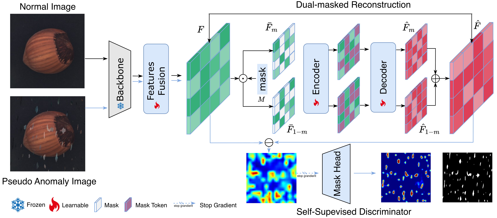

# D2Rec

> Official PyTorch Implementation of [Dual-Masked and Discriminative Reconstruction for Unified Vision Anomaly Detection](https://ieeexplore.ieee.org/document/11503645/), IEEE TIP.

## Introduction 
D2Rec is a simple, effective, general and robust unified (multi-class) vision anomaly detection framework that integrates unsupervised dual-masked reconstruction and a self-supervised discriminator, achieving competitive performance on both industrial and medical anomaly detection benchmarks.

## D2Rec Framework



## 1. Environments

Create a new conda environment and install required packages.

```
conda create -n d2rec python=3.8.12
conda activate d2rec
pip install -r requirements.txt
```

## 2. Prepare Datasets

### MVTec AD
```
|-- mvtec
    |-- bottle
    |-- cable
    |-- capsule
    |-- ....
    |-- meta.json
```
### VisA
```
|-- visa
    |-- candle
    |-- capsules
    |-- cashew
    |-- ....
    |-- meta.json
```

### BTAD
```
|-- btad
    |-- 01
    |-- 02
    |-- 03
    |-- meta.json
```

### Medical
```
|-- medical
    |-- brain
    |-- liver
    |-- retinal
    |-- meta.json
```

## 3. Training
using unified (i.e., multi-class) vision anomaly setting
```
image_size=224
for dataset in mvtec visa btad medical
do 
CUDA_VISIBLE_DEVICES=0 python3 main.py  \
   --data_path   "./datasets/"$dataset \
   --dataset $dataset \
   --image_size ${image_size} \
   --batch_size 16 \
   --dual_mask \
   --mask_head
done
```

## 4. Evaluation
```
image_size=224
for dataset in mvtec visa btad medical
do 
CUDA_VISIBLE_DEVICES=0 python3 main.py  \
   -e \
   --data_path   "./datasets/"$dataset \
   --dataset $dataset \
   --save_path  "./checkpoints/" \
   --image_size ${image_size} \
   --batch_size 16 \
   --dual_mask \
   --mask_head
done
```


## Citing
If you find this code useful in your research, please consider citing us:

```
@article{gao2026d2rec,
  title  = {Dual-Masked and Discriminative Reconstruction for Unified Vision Anomaly Detection},
  author = {Gao, Bin-Bin},
  booktitle = {IEEE Transactions on Image Processing},
  pages = {4701-4712},
  year = {2026}
}
```


## Star History

[](https://www.star-history.com/#gaobb/MetaUAS&Timeline)
